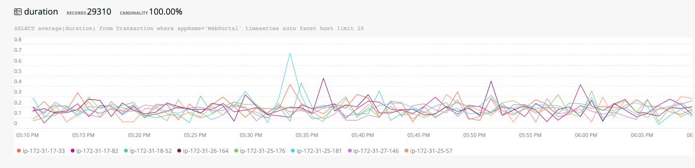

# The Facinator
A utility application that lets you easily explore the facets of the data from an NRQL query. Particularly useful in incident investigation or dashboard creation if you are tyring to understand how faceting a query by different facets affects the data.

## Usage

1. Supply a NRQL query, making sure to exclude any 'SELECT', 'TIMESERIES' or 'FACET'
2. Provide an aggregator function (such as `count(*)`, `average(*)`, etc. Every facet will be automatically graphed using this function)
3. Enter the account ID (it should auto populate if possible)
4. Click the Analyse button

> The optional settings allow you to finely configure the output, generally they can be left as they are.

### Facet Breakdown

Once the anlysis is complete the table on the left will show all the facets available in data returned from the query. It indicates how many unique values of each facet are present, how many records include the facet and its coverage (some facets only appear on some records). Clicking on a facet will jump to it on the right hand side...

### Details Tab

The right hand column defaults to the Details tab. This tab illustrates each facet in turn: It summarises the facets displaying the occurences of each unique value and renders a timeseries chart of each facet using the aggregator supplied (e.g. count(*) )

### Explore tab

The explore tab is similar to the details tab except it allows you to facet each facet! It uses Explore Settings to further carve up the data. In the settings you can provide an aggregator function such as `average($FIELD$)` . Then add the facets your want to facet by, such as `host`. This will then render every facet in the data faceted by the facets you supply. Lots of facets!

Its possible to provide more than one aggregator function eg. `average($FIELD$), percentile($FIELD$,90)` but be aware you cant then uuse the facet options.

## A large screenshot

This screen grab gives you an idea of the whole application. Its much longer than this as there are a lot of facets on the test data!

